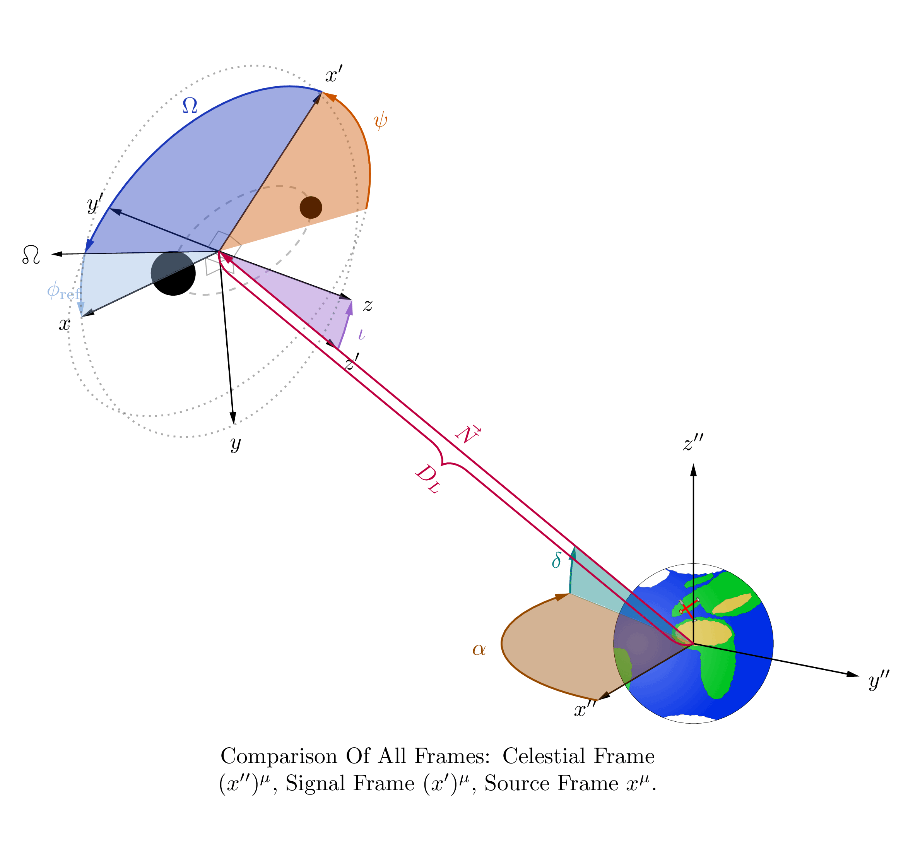

# GWFrames

Gravitational-wave coordinate systems visualized in LaTeX.



## Usage

This repository provides three packages, each with one command:

- `cbc_frames_tikz` (command `\drawframes`): plots a selection of source frame,
  signal frame, and celestial frame that are used to describe gravitational waves
  emitted by compact binary coalescences.

- `cbc_binary_tikz` (command `\drawbinary`): plots intrinsic parameters of a
  system of two compact binary objects. Adapted from code originally written
  by Jannik Mielke.

- `earth_tikz` (command `\drawearth`): plots one side of the Earth. Mainly
  intended for usage through `\drawframes`. Most of the credit for this code
  goes to Izaak Neutelings, who published it on https://tikz.net/astronomy_seasons/.

Keyword arguments to these commands are supported. A summary of the most
important options is given in the [Key options](#key-options) section below;
a complete list is available in the accompanying `documentation.pdf`
(if something is still unclear, do not hesitate to ask me).

### Quick start

Producing output with this package is as easy as

```latex
\documentclass[tikz, border=3pt]{standalone}
\usepackage{cbc_frames_tikz}

\begin{document}
\begin{tikzpicture}
    \drawframes[angles={inclination=30, polarization=45, ra=20, dec=10}]
\end{tikzpicture}
\end{document}
```

### Examples

The [examples/](examples/) folder contains several standalone `.tex` files:

- [examples/tutorial.tex](examples/tutorial.tex) — shows all three ways to pass keyword arguments
- [examples/all_frames.tex](examples/all_frames.tex) — all three frames together
- [examples/source_frame.tex](examples/source_frame.tex) — source frame only
- [examples/signal_frame.tex](examples/signal_frame.tex) — signal frame only
- [examples/celestial_frame.tex](examples/celestial_frame.tex) — celestial frame only
- [examples/earth.tex](examples/earth.tex) — Earth standalone
- [examples/psi_zero_test.tex](examples/psi_zero_test.tex) — demonstration of polarization angle convention

### Key options

**`\drawframes`** (`cbc_frames_tikz`)

| Option | Default | Description |
|---|---|---|
| `angles/inclination` | `0` | Inclination angle $\iota$ |
| `angles/polarization` | `0` | Polarization angle $\psi$ |
| `angles/longascnodes` | `0` | Longitude of ascending node $\Omega$ |
| `angles/phiref` | `0` | Reference phase $\phi_\mathrm{ref}$ |
| `angles/ra` | `0` | Right ascension $\alpha$ |
| `angles/dec` | `0` | Declination $\delta$ |
| `sourceframe/show` | `true` | Show the source frame |
| `signalframe/show` | `true` | Show the signal frame |
| `celestialframe/show` | `true` | Show the celestial frame |
| `binary/show` | `true` | Show the binary system |
| `earth/radius` | `1.25` | Radius of the Earth sphere |
| `distance/value` | `5` | Length of the line-of-sight arrow |
| `axislen` | `3` | Length of the coordinate axes |

Each angle key also accepts a `show` sub-key (e.g. `polarization/show=false`) to hide the corresponding arc/label.

**`\drawbinary`** (`cbc_binary_tikz`)

| Option | Default | Description |
|---|---|---|
| `mass1` | `20` | Mass of the first object |
| `mass2` | `10` | Mass of the second object |
| `spin1x/y/z` | `0` | Spin components of the first object |
| `spin2x/y/z` | `0` | Spin components of the second object |
| `eccentricity` | `0` | Orbital eccentricity |
| `separation` | `6` | Visual separation of the two objects |
| `showcombinedquantities` | `true` | Show total mass / effective spin labels |

**`\drawearth`** (`earth_tikz`)

| Option | Default | Description |
|---|---|---|
| `radius` | `1` | Radius of the Earth |
| `tilt` | `0` | Axial tilt of the Earth |

## Requirements

The packages require a standard LaTeX distribution with the following packages available:

- `tikz` and `tikz-3dplot` (part of the `pgf`/`TikZ` bundle)
- `xcolor`
- `etoolbox`
- `wasysym` (for the ascending node symbol, used by `cbc_frames_tikz`)

All of these ship with TeX Live and MiKTeX by default.

## Installation

Unfortunately, adding LaTeX packages is not as easy as Python packages. I do not
claim to be an expert in this, but here are two ways I have found to make this work:

1. putting the relevant `.sty` files into the same directory as the `.tex` you
   plan to use them in. Then, `\usepackage{cbc_frames_tikz}` works. If your
   folder structure is slightly more complicated, something like
   `\usepackage{../cbc_frames_tikz}` works too (despite some complaints by LaTeX).
   This is also the preferred way in case you are using Overleaf.

1. for a recipe on how to make the package available on your whole system,
   please refer to the instructions on
   [my GitHub](https://github.com/MaxMelching/latex_package_install).

## Contributing

Bug reports, feature requests, and questions are welcome — please open an
[issue on GitHub](https://github.com/MaxMelching/gwframes/issues) or reach out
by email (m-melching@web.de).

## License

[MIT](LICENSE) © 2026 Max Melching
